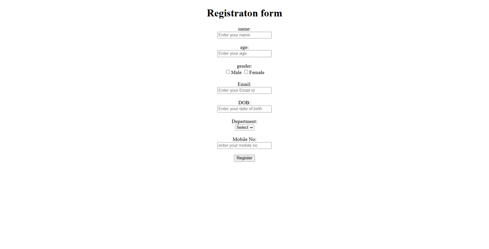

## Day 2: Semantic HTML & Forms

### 📚 Topics Covered

### 🔹 Semantic HTML Tags
- `<header>` – Represents the top section of a page
- `<nav>` – Navigation links section
- `<main>` – Main content area
- `<section>` – Groups related content
- `<article>` – Independent content block
- `<footer>` – Bottom section of a page

### 🔹 Forms in HTML
- `<input>` – Accepts user input
- `<textarea>` – Multi-line text input
- `<select>` – Dropdown menu
- `<button>` – Clickable button

### 🔹 Important Attributes
- `name` – Identifies form data
- `value` – Default value of input
- `required` – Makes field mandatory
- `placeholder` – Shows hint text

---

## 🛠 Mini Project: Registration Form

Built a simple registration form using semantic HTML elements including:

- Name field
- Age field
- Gender selection (radio buttons)
- Email field
- Date of Birth
- Department dropdown
- Mobile number field
- Submit button

This project helped in understanding form structure and semantic layout in HTML.
## 📷 Output Screenshot

 ## 📷 Output

